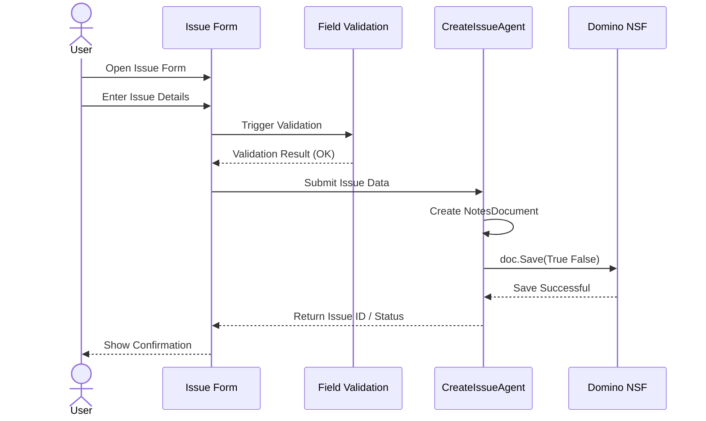

# Sequence Diagram — User Creates an Issue in HCL Domino

## Steps Explained

1. **User** opens the form and enters data.
2. The **Form** performs client-side or server-side validation.
3. **CreateIssueAgent** receives validated data.
4. Agent constructs a **NotesDocument** and executes `doc.Save(True, False)`.
5. Document is written to the **NSF database**.
6. Confirmation is returned back to the user.
