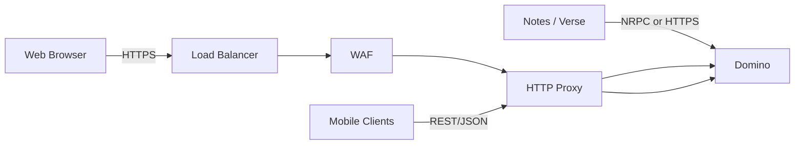
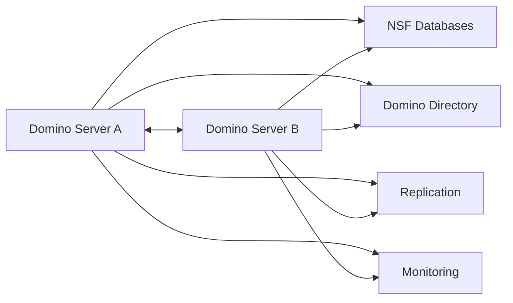
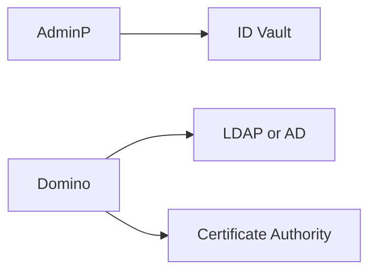
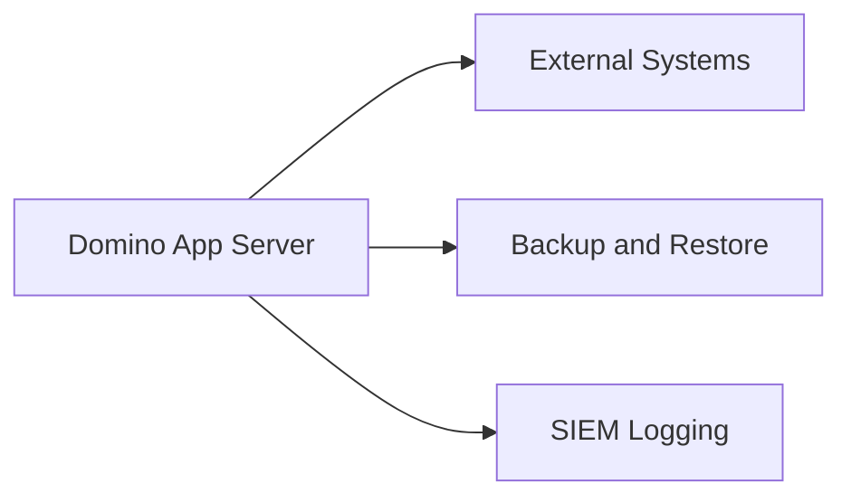

# HCL Domino Architecture Diagrams (Split Version)

Below are simplified, smaller diagrams to make each part easier to understand.

---

## 1. Client Access Architecture

---

## 2. Domino Core Server Architecture

---

## 3. Security and Identity Components

---

## 4. Integration Landscape

---

