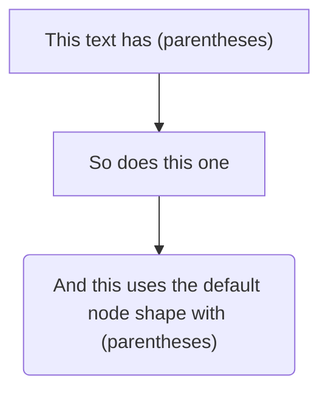
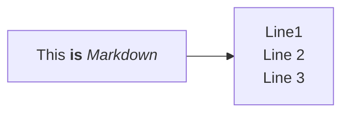
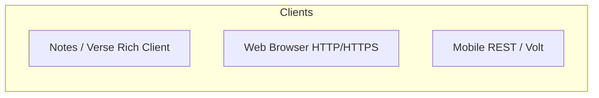
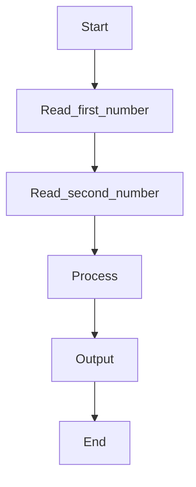

## Architecture
```sql
select * from users where userName ='Test'
```


```mermaid
graph TD
    A["This text has (parentheses)"] --> B["So does this one"];
    B --> C("And this uses the default node shape with (parentheses)");

```


```mermaid
flowchart LR
    markdown["`This **is** _Markdown_`"]
    newLines["`Line1
    Line 2
    Line 3`"]
    markdown --> newLines
```


```mermaid
flowchart LR
	subgraph Clients
		NotesClient[Notes / Verse Rich Client]
		WebBrowser[Web Browser HTTP/HTTPS]
		Mobile[Mobile REST / Volt]
	end
```


```mermaid
flowchart TD
    Start --> Read_first_number
    Read_first_number --> Read_second_number
    Read_second_number --> Process
    Process --> Output
    Output --> End
```