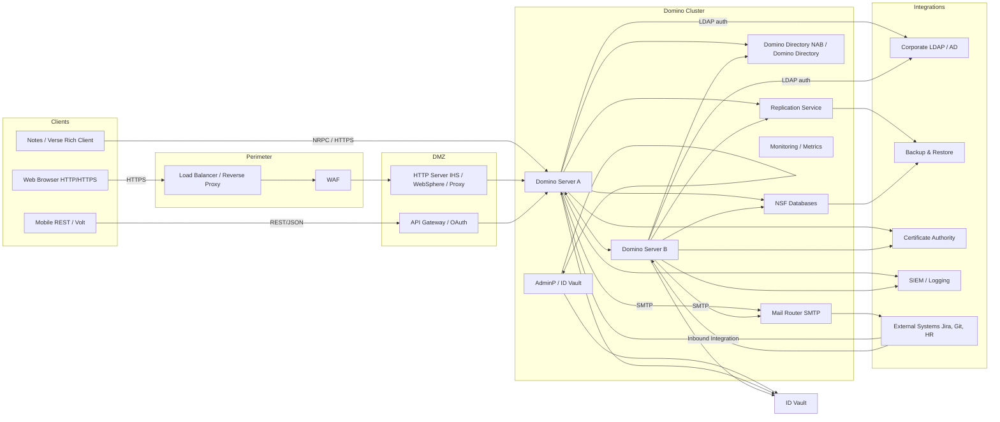

# HCL Domino Architecture Diagram

Below is a ready-to-use architecture diagram (markdown + Mermaid) and explanation for an HCL Domino deployment suitable for an enterprise Issue Tracker app. Paste the Mermaid block into any Mermaid renderer (or use the visual in this canvas) to render the diagram.

---

## Mermaid diagram

---

## Components & Notes

* **Clients**: Notes rich client (NRPC / HTTP), web browsers via HTTP(S), and mobile/Volt clients using REST/JSON.
* **Load Balancer / WAF**: Terminate TLS, do health checks, route to HTTP Server (IHS/Nginx) and Domino HTTP task.
* **Web Server / API Gateway**: Serve static content, provide OAuth/OpenID Connect, API rate limiting, and proxy REST calls to Domino web agents or Domino Access Services.
* **Domino Cluster**: Multiple Domino servers for HA. NSF databases (applications, mail files, full-text indexes) are stored here and serviced by Domino HTTP and NRPC.
* **Domino Directory (NAB)**: Central user directory and person documents for authentication/lookup.
* **Replication Service**: Domino replication between servers for database copies, offline resilience, and load distribution.
* **Mail Router / SMTP**: Handles inbound/outbound mail. Integrates with corporate mail gateways.
* **AdminP / ID Vault**: Centralized administration and ID management for signing agents and recovering IDs.
* **Monitoring & SIEM**: Export logs/metrics to monitoring system; integrate with backup and patching systems.
* **Integrations**: AD/LDAP for auth, Certificate Authority, Backup systems, External APIs (Jira, Git), and SIEM.

## Security & Operational Considerations

* Use TLS (HTTPs) everywhere; manage certs via CA and automate renewal.
* Sign agents and DXL with secure admin IDs; store production IDs in ID Vault.
* Limit server admin ACLs; use least privilege.
* Schedule SLAUpdater/agents on servers with capacity planning and monitor CPU/IO.
* Use Domino clustering + replication to reduce single points of failure.
* Maintain DXL source in Git for CI/CD; import DXL into Domino Designer in CI pipeline for deployments.

## Deployment Patterns

* **Single-region HA**: 2 or more Domino servers behind a load balancer + replicated NSFs.
* **Multi-region**: Active-active replication between data centers; careful conflict resolution for writes.
* **Staging/Prod**: Use CI to package DXL; automated import to staging NSF; manual approval to promote to production.

---

If you want, I can:

* Export this diagram as an image (PNG/SVG) and add to the canvas, or
* Produce a simplified 1-page Visio/Draw.io XML export, or
* Provide a PowerPoint slide with the diagram and notes.

Which format would you like next?
