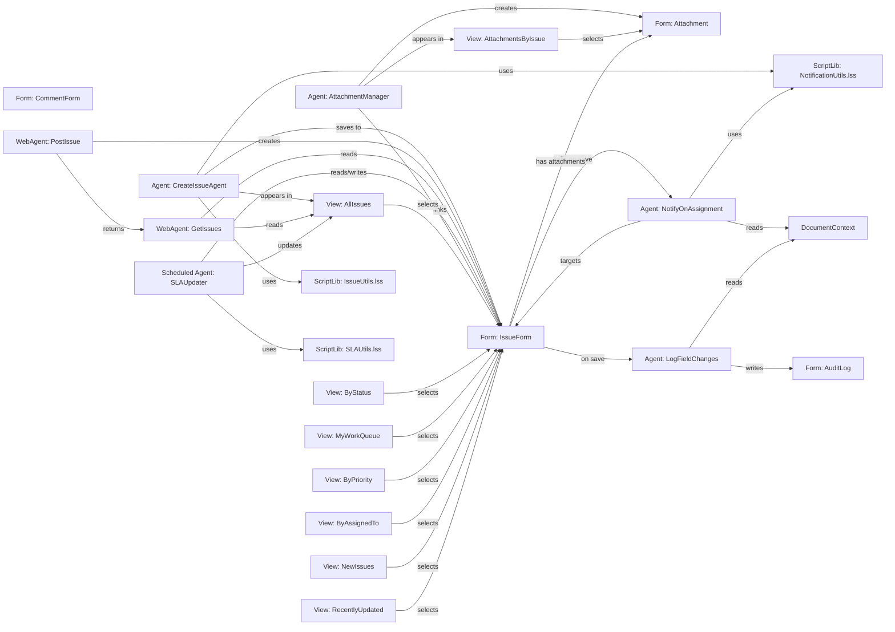

## Dependency diagram

```mermaid
graph LR
  %% Forms & Views
  IssueForm[Form: IssueForm]
  CommentForm[Form: CommentForm]
  AuditLogForm[Form: AuditLog]
  AttachmentForm[Form: Attachment]

  AllIssues[View: AllIssues]
  ByStatus[View: ByStatus]
  MyWorkQueue[View: MyWorkQueue]
  ByPriority[View: ByPriority]
  ByAssignedTo[View: ByAssignedTo]
  NewIssues[View: NewIssues]
  RecentlyUpdated[View: RecentlyUpdated]
  AttachmentsByIssue[View: AttachmentsByIssue]

  %% Script Libraries
  IssueUtils[ScriptLib: IssueUtils.lss]
  NotificationUtils[ScriptLib: NotificationUtils.lss]
  SLAUtils[ScriptLib: SLAUtils.lss]

  %% Agents / Web endpoints
  CreateAgent[Agent: CreateIssueAgent]
  SLAUpdater[Scheduled Agent: SLAUpdater]
  NotifyAssign[Agent: NotifyOnAssignment]
  LogChanges[Agent: LogFieldChanges]
  GetIssues[WebAgent: GetIssues]
  PostIssue[WebAgent: PostIssue]
  AttachMgr[Agent: AttachmentManager]

  %% Edges: who uses / depends on who
  CreateAgent -->|uses| IssueUtils
  CreateAgent -->|uses| NotificationUtils
  CreateAgent -->|saves to| IssueForm
  CreateAgent -->|appears in| AllIssues

  PostIssue -->|creates| IssueForm
  PostIssue -->|returns| GetIssues
  GetIssues -->|reads| AllIssues
  GetIssues -->|reads| IssueForm

  SLAUpdater -->|uses| SLAUtils
  SLAUpdater -->|reads/writes| IssueForm
  SLAUpdater -->|updates| AllIssues

  NotifyAssign -->|uses| NotificationUtils
  NotifyAssign -->|reads| DocumentContext
  NotifyAssign -->|targets| IssueForm

  LogChanges -->|writes| AuditLogForm
  LogChanges -->|reads| DocumentContext

  AttachMgr -->|creates| AttachmentForm
  AttachMgr -->|links| IssueForm
  AttachMgr -->|appears in| AttachmentsByIssue

  %% Views depend on IssueForm
  AllIssues -->|selects| IssueForm
  ByStatus -->|selects| IssueForm
  MyWorkQueue -->|selects| IssueForm
  ByPriority -->|selects| IssueForm
  ByAssignedTo -->|selects| IssueForm
  NewIssues -->|selects| IssueForm
  RecentlyUpdated -->|selects| IssueForm
  AttachmentsByIssue -->|selects| AttachmentForm

  %% Cross-links (helpful shortcuts)
  IssueForm -->|calls on save| NotifyAssign
  IssueForm -->|on save| LogChanges
  IssueForm -->|has attachments| AttachmentForm

```