# HCL Domino Issue Tracker - Dependency Diagram

This document shows the dependencies between agents, script libraries, forms, and views in the Issue Tracker application.

## Dependency Diagram

```mermaid
graph TB
    %% Script Libraries (Green)
    subgraph Libraries["Script Libraries"]
        IssueUtils["IssueUtils.lss<br/>(GenerateIssueID, LinkRelatedIssues)"]
        NotificationUtils["NotificationUtils.lss<br/>(SendIssueNotification)"]
        SLAUtils["SLAUtils.lss<br/>(ComputeSLADeadline)"]
    end

    %% Forms (Orange)
    subgraph Forms["Forms"]
        IssueForm["IssueForm.dxl<br/>(Main Issue Form)"]
        AuditLogForm["AuditLog Form<br/>(Referenced by LogFieldChanges)"]
    end

    %% Views (Purple)
    subgraph Views["Views"]
        AllIssuesView["AllIssuesView.dxl<br/>(SELECT Form = 'IssueForm')"]
        ByAssignedToView["ByAssignedToView.dxl<br/>(SELECT Form = 'Issue')"]
        ByPriorityView["ByPriorityView.dxl<br/>(SELECT Form = 'Issue')"]
        ByStatusView["ByStatusView.dxl<br/>(SELECT Form = 'Issue')"]
        MyIssuesView["MyIssuesView.dxl<br/>(SELECT Form = 'Issue')"]
        NewIssuesView["NewIssuesView.dxl<br/>(SELECT Form = 'Issue')"]
    end

    %% Agents (Blue)
    subgraph Agents["Agents"]
        CreateIssueAgent["CreateIssueAgent.lss<br/>(Creates Issue documents)"]
        GetIssues["GetIssues.lss<br/>(Returns JSON list)"]
        IssuesJSONAgent["IssuesJSONAgent.lss<br/>(Returns JSON with escape)"]
        LogFieldChanges["LogFieldChanges.lss<br/>(Creates AuditLog docs)"]
        NotifyOnAssignment["NotifyOnAssignment.lss<br/>(Sends notifications)"]
        PostIssue["PostIssue.lss<br/>(Creates Issue via web)"]
        SLAUpdater["SLAUpdater.lss<br/>(Updates SLA status)"]
    end

    %% Agent to Library Dependencies
    CreateIssueAgent -->|Uses| IssueUtils
    CreateIssueAgent -->|Uses| NotificationUtils
    NotifyOnAssignment -->|Uses| NotificationUtils
    SLAUpdater -->|Uses| SLAUtils

    %% Agent to Form Dependencies
    CreateIssueAgent -->|Creates| IssueForm
    PostIssue -->|Creates| IssueForm
    NotifyOnAssignment -.->|Reads| IssueForm
    LogFieldChanges -->|Creates| AuditLogForm

    %% Agent to View Dependencies
    GetIssues -->|Reads| AllIssuesView
    IssuesJSONAgent -->|Reads| AllIssuesView
    SLAUpdater -->|Reads| AllIssuesView

    %% View to Form Dependencies
    AllIssuesView -->|Selects| IssueForm
    ByAssignedToView -->|Selects| IssueForm
    ByPriorityView -->|Selects| IssueForm
    ByStatusView -->|Selects| IssueForm
    MyIssuesView -->|Selects| IssueForm
    NewIssuesView -->|Selects| IssueForm

    %% Styling
    classDef agentStyle fill:#4A90E2,stroke:#2E5C8A,stroke-width:2px,color:#fff
    classDef libraryStyle fill:#50C878,stroke:#2D8659,stroke-width:2px,color:#fff
    classDef formStyle fill:#FF8C42,stroke:#CC6F35,stroke-width:2px,color:#fff
    classDef viewStyle fill:#9B59B6,stroke:#7D3C98,stroke-width:2px,color:#fff

    class CreateIssueAgent,GetIssues,IssuesJSONAgent,LogFieldChanges,NotifyOnAssignment,PostIssue,SLAUpdater agentStyle
    class IssueUtils,NotificationUtils,SLAUtils libraryStyle
    class IssueForm,AuditLogForm formStyle
    class AllIssuesView,ByAssignedToView,ByPriorityView,ByStatusView,MyIssuesView,NewIssuesView viewStyle
```

## Dependency Summary

### Script Libraries (No Dependencies)
- **IssueUtils.lss** - Standalone utility functions
- **NotificationUtils.lss** - Standalone notification functions
- **SLAUtils.lss** - Standalone SLA calculation functions

### Agents Dependencies

| Agent | Uses Libraries | References Forms | References Views |
|-------|---------------|------------------|------------------|
| **CreateIssueAgent** | IssueUtils, NotificationUtils | IssueForm | - |
| **GetIssues** | - | - | AllIssuesView |
| **IssuesJSONAgent** | - | - | AllIssuesView |
| **LogFieldChanges** | - | AuditLog | - |
| **NotifyOnAssignment** | NotificationUtils | IssueForm (via DocumentContext) | - |
| **PostIssue** | - | IssueForm | - |
| **SLAUpdater** | SLAUtils | - | AllIssuesView |

### Views Dependencies

All views depend on the **IssueForm**:
- **AllIssuesView** - `SELECT Form = "IssueForm"`
- **ByAssignedToView** - `SELECT Form = "Issue"`
- **ByPriorityView** - `SELECT Form = "Issue"`
- **ByStatusView** - `SELECT Form = "Issue"`
- **MyIssuesView** - `SELECT Form = "Issue" & @IsMember(@UserName; AssignedTo)`
- **NewIssuesView** - `SELECT Form = "Issue" & Status = "New"`

### Forms

- **IssueForm** - Main form, referenced by all views and multiple agents
- **AuditLog** - Referenced by LogFieldChanges agent (form name only, not DXL file)

## Dependency Flow

1. **Script Libraries** → Used by **Agents** (no circular dependencies)
2. **Agents** → Create/Read **Forms** and **Views**
3. **Views** → Select documents from **Forms**
4. **Forms** → Define document structure used by **Agents** and **Views**

## Notes

- All script libraries are independent (no inter-library dependencies)
- IssueForm is the central artifact, referenced by all views and most agents
- AllIssuesView is the most commonly used view (3 agents reference it)
- NotificationUtils is used by 2 agents (CreateIssueAgent, NotifyOnAssignment)
- Some views reference "Issue" form name while others reference "IssueForm" - this may need standardization
