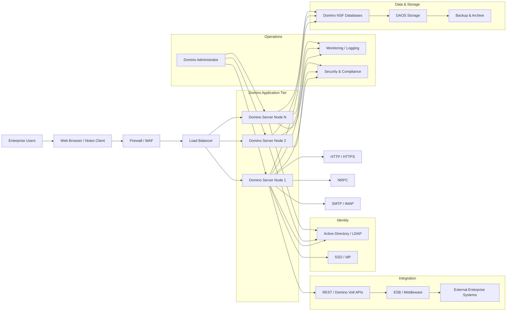

```mermaid
flowchart LR

%% User Access Layer
U[Enterprise Users]
B[Web Browser / Notes Client]

U --> B

%% Network & Security Layer
LB[Load Balancer]
FW[Firewall / WAF]

B --> FW --> LB

%% Domino Application Tier
subgraph Domino_App_Tier[Domino Application Tier]
  D1[Domino Server Node 1]
  D2[Domino Server Node 2]
  D3[Domino Server Node N]
end

LB --> D1
LB --> D2
LB --> D3

%% Domino Services
D1 --> SVC1[HTTP / HTTPS]
D1 --> SVC2[NRPC]
D1 --> SVC3[SMTP / IMAP]

%% Directory & Identity
subgraph Identity
  AD[Active Directory / LDAP]
  IDP[SSO / IdP]
end

D1 --> AD
D2 --> AD
D3 --> AD

D1 --> IDP

%% Data Layer
subgraph Data_Layer[Data & Storage]
  NSF[Domino NSF Databases]
  DAOS[DAOS Storage]
  BKP[Backup & Archive]
end

D1 --> NSF
D2 --> NSF
D3 --> NSF

NSF --> DAOS
DAOS --> BKP

%% Administration & Monitoring
subgraph Ops[Operations]
  ADM[Domino Administrator]
  MON[Monitoring / Logging]
  SEC[Security & Compliance]
end

ADM --> D1
ADM --> D2
ADM --> D3

D1 --> MON
D2 --> MON
D3 --> MON

D1 --> SEC
D2 --> SEC
D3 --> SEC

%% Integration Layer
subgraph Integration
  API[REST / Domino Volt APIs]
  ESB[ESB / Middleware]
  EXT[External Enterprise Systems]
end

D1 --> API --> ESB --> EXT
```
